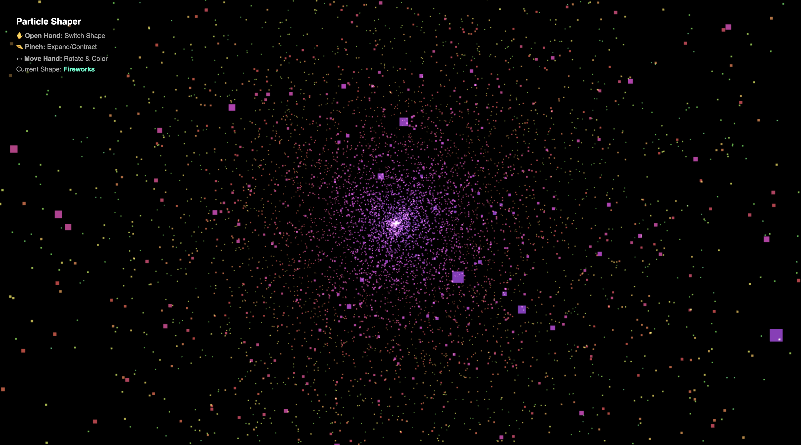

# Particle Shaper

An interactive, hand-tracked 3D particle visualization system that responds to real-time hand gestures using AI-powered hand detection.

## Overview

Particle Shaper is an AI-generated interactive web application built entirely with **Google AI Studio**. This project demonstrates the capabilities of AI-assisted development by combining cutting-edge web technologies to create a mesmerizing experience where thousands of particles form dynamic 3D shapes controlled by your hand movements. Using MediaPipe's hand-tracking AI and Three.js for 3D rendering, this application transforms your webcam input into an immersive particle manipulation interface.

## Screenshots



*Interactive particle visualization controlled by hand gestures*

## Features

- **Hand-Tracked Gesture Control**: Real-time hand detection with intuitive gesture recognition
- **Multiple Shape Morphing**: Switch between various 3D geometric shapes using hand gestures
- **Dynamic Particle System**: 8,000 particles with smooth animations and physics-based movement
- **Interactive Controls**:
  - **Open Hand**: Switch between different particle shapes
  - **Pinch Gesture**: Expand or contract the particle formation
  - **Hand Movement**: Rotate shapes and change particle colors dynamically
- **Visual Feedback**: Live webcam preview and on-screen UI controls
- **High Performance**: GPU-accelerated rendering with Three.js and WebGL

## Technologies

- **Three.js**: 3D graphics library for rendering particles and animations
- **MediaPipe**: AI framework for hand detection and pose estimation
- **WebGL**: Hardware-accelerated graphics rendering
- **HTML5 Canvas**: Real-time graphics drawing
- **JavaScript**: Core application logic

## Getting Started

### Prerequisites

- Modern web browser with WebGL support (Chrome, Firefox, Edge, Safari)
- Webcam or camera device
- Camera permissions enabled in your browser

### Installation

1. Clone or download the repository
2. Open `particles.html` in your web browser
3. Grant camera permissions when prompted
4. Start interacting with your hands!

## Usage

1. **Launch the Application**: Open `particles.html` in your browser
2. **Allow Camera Access**: Grant permission to access your webcam
3. **Control the Particles**:
   - Move your hands to rotate and transform the particle shapes
   - Open your hand fully to switch between different shapes
   - Pinch your fingers together to expand or contract particles
   - Move your hand around the screen to change colors and positions

### UI Elements

- **Shape Name Display**: Shows the currently active particle shape
- **Video Preview**: Live webcam feed in the bottom-left corner (flipped for mirror view)
- **Control Instructions**: On-screen guide showing all available gestures

## Configuration

Customize the particle behavior by modifying these settings in the JavaScript section:

```javascript
const PARTICLE_COUNT = 8000;        // Number of particles to render
const PARTICLE_SIZE = 0.15;         // Individual particle size
const SHAPE_SWITCH_COOLDOWN = 1500; // Gesture cooldown in milliseconds
```

## Performance Considerations

- **Particle Count**: Adjust `PARTICLE_COUNT` based on your device's GPU capabilities
- **Rendering**: Uses additive blending for smooth transparency effects
- **Optimization**: Implements BufferGeometry for efficient memory usage with large particle counts

## Browser Compatibility

| Browser | Support | Notes |
|---------|---------|-------|
| Chrome  | ✅ Full | Recommended for best performance |
| Firefox | ✅ Full | Works well with recent versions |
| Safari  | ✅ Full | iOS support for compatible devices |
| Edge    | ✅ Full | Chromium-based, excellent performance |

## Troubleshooting

### Camera not working
- Check browser permissions and grant camera access
- Ensure no other application is using the camera
- Try a different browser if the issue persists

### Low performance / Lag
- Reduce `PARTICLE_COUNT` for less powerful devices
- Close other browser tabs and applications
- Check GPU acceleration is enabled in browser settings
- Update your graphics drivers

### Gestures not detecting
- Ensure adequate lighting conditions
- Keep hands within camera frame
- Move slowly and deliberately for better tracking

## Future Enhancements

- Sound visualization and audio reactivity
- Multiple hand tracking and interaction
- Custom particle shape creation
- Recording and playback of particle animations
- Mobile device optimization

## License

MIT License

Copyright (c) 2025 Particle Shaper

Permission is hereby granted, free of charge, to any person obtaining a copy
of this software and associated documentation files (the "Software"), to deal
in the Software without restriction, including without limited to the rights
to use, copy, modify, merge, publish, distribute, sublicense, and/or sell
copies of the Software, and to permit persons to whom the Software is
furnished to do so, subject to the following conditions:

The above copyright notice and this permission notice shall be included in all
copies or substantial portions of the Software.

THE SOFTWARE IS PROVIDED "AS IS", WITHOUT WARRANTY OF ANY KIND, EXPRESS OR
IMPLIED, INCLUDING BUT NOT LIMITED TO THE WARRANTIES OF MERCHANTABILITY,
FITNESS FOR A PARTICULAR PURPOSE AND NONINFRINGEMENT. IN NO EVENT SHALL THE
AUTHORS OR COPYRIGHT HOLDERS BE LIABLE FOR ANY CLAIM, DAMAGES OR OTHER
LIABILITY, WHETHER IN AN ACTION OF CONTRACT, TORT OR OTHERWISE, ARISING FROM,
OUT OF OR IN CONNECTION WITH THE SOFTWARE OR THE USE OR OTHER DEALINGS IN THE
SOFTWARE.

## Credits

**Built with Google AI Studio** - This entire project was generated and developed using Google AI Studio, showcasing the power of AI-assisted web development.

### Libraries & Frameworks

- **MediaPipe**: Hand detection and pose estimation (by Google)
- **Three.js**: 3D graphics library
- **WebGL**: Hardware-accelerated graphics rendering

## Support

For issues, suggestions, or improvements, please refer to the browser console for any error messages or contact the project maintainer.

---

**Enjoy creating beautiful particle art with your hands!** ✨
